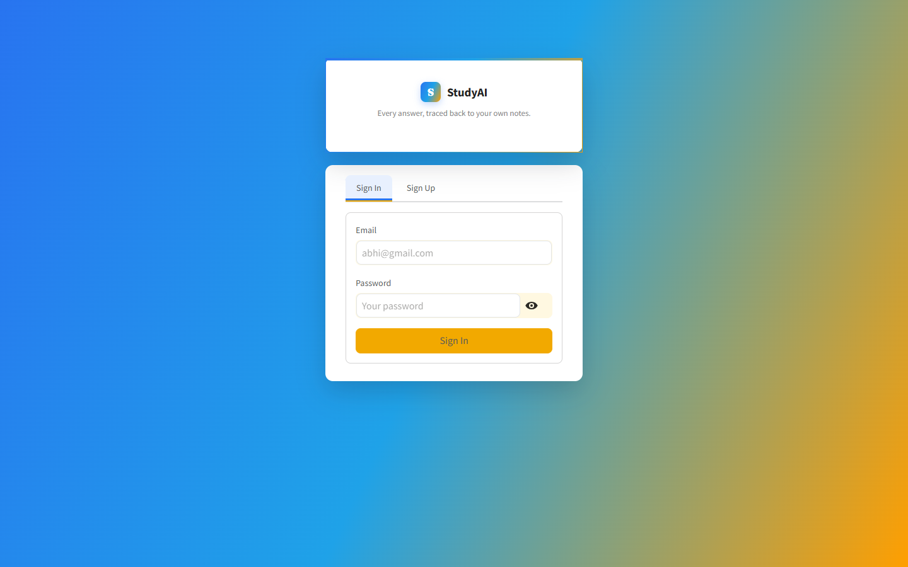
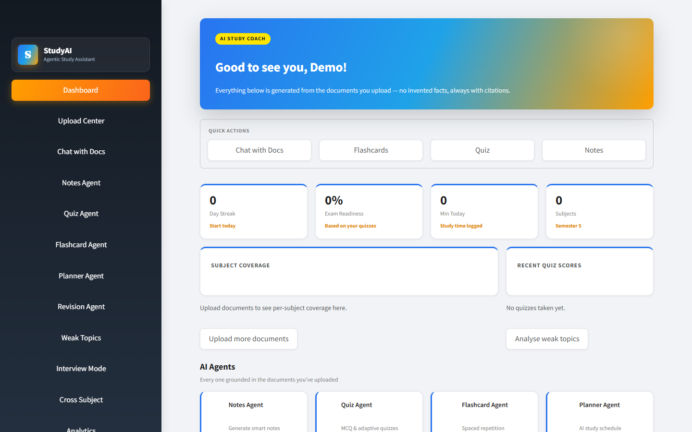
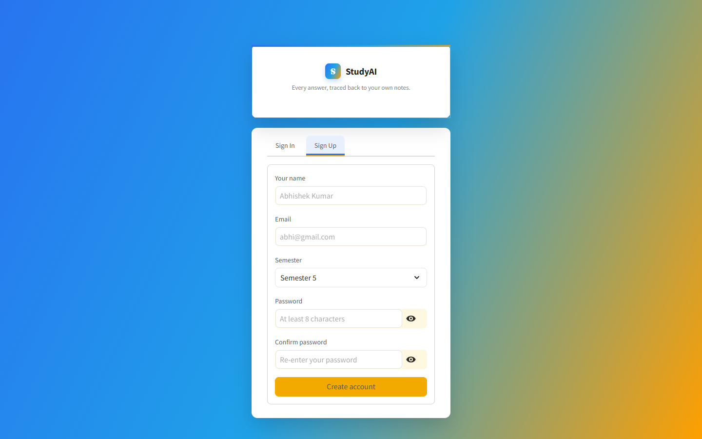

# StudyAI — Subject Guide & Question Bank Assistant

A retrieval-augmented study assistant. Upload your own notes, textbooks or
slides, and every answer, summary, quiz question, flashcard and mock-interview
question is generated **from those documents, with citations** — and when the
answer isn't in them, it says so instead of guessing.

**[Live demo](https://subject-guide-and-question-bank-assistant-ai-agent-jtomhsyrpfj.streamlit.app/)** ·
Python · Streamlit · Sentence Transformers · FAISS · OpenRouter

## The problem

General-purpose chatbots answer exam questions confidently, but not
necessarily from the syllabus a student is actually being tested on — and
they rarely admit when they don't know. Students need answers tied to
*their* material, with a way to check where each answer came from.

## How it works

```
Upload PDF · DOCX · PPTX · TXT
      │  PyPDF2 / python-docx / python-pptx
      ▼
Text extraction ─► chunking (LangChain text splitters, 900 chars / 150 overlap)
      │
      ▼
Embeddings (all-MiniLM-L6-v2) ─► FAISS index (cosine similarity)
      │
      ▼
Question ─► top-k retrieval ─► relevance check ──► no match: explicit refusal
                                     │
                                     ▼
                     LLM via OpenRouter ─► grounded answer + source citations
```

The same retrieval layer feeds every study tool, so quizzes, notes and
interview questions are grounded in the uploaded material too.

## Features

| Study tool | What it does |
|---|---|
| **Chat** | Streaming Q&A over your documents, cited to source pages, with conversation history |
| **Notes** | Summaries (short / medium / long), chapter & topic explanations, generated notes |
| **Question bank** | 2 / 5 / 10-mark questions, important questions, previous-paper analysis |
| **Quiz** | Generated quizzes with automatic grading |
| **Flashcards** | Leitner-system spaced repetition |
| **Planner & revision** | Day-by-day study plan and rapid revision sheets |
| **Weak topics** | Diagnostics from quiz performance |
| **Cross subject** | Reasoning across more than one document |
| **Mock interview** | Viva-style questions with graded answers |
| **Analytics** | Progress charts |

Accounts are per-user: documents, chats, quizzes and flashcards are scoped to
the signed-in user. Data lives in SQLite locally, or in a hosted libSQL
database (Turso) when deployed.

## Screenshots

| Sign in | Dashboard |
| --- | --- |
|  |  |

| Sign up |
| --- |
|  |

## Tech stack

| Area | Tools |
|---|---|
| App | Python, Streamlit |
| Document parsing | PyPDF2, python-docx, python-pptx |
| Retrieval | LangChain text splitters, Sentence Transformers (PyTorch, CPU), FAISS |
| Generation | OpenRouter API (hosted LLMs) |
| Storage | SQLite / Turso (libSQL) |
| Charts | Pandas, Plotly |

## Run it locally

```bash
git clone https://github.com/SobhanaAishwarya/Subject-Guide-and-Question-bank-Assistant-AI-Agent.git
cd Subject-Guide-and-Question-bank-Assistant-AI-Agent
pip install -r requirements.txt

cd studyai_streamlit/studyai
cp .env.example .env        # add your OpenRouter API key
streamlit run streamlit_app.py
```

The first run downloads the embedding model (~90 MB) once. Full setup,
deployment and persistence notes are in
[`studyai_streamlit/studyai/README.md`](studyai_streamlit/studyai/README.md).

## Repository layout

```
├── streamlit_app.py              # entry point used by Streamlit Cloud
├── requirements.txt              # points to the app's requirements
└── studyai_streamlit/studyai/
    ├── streamlit_app.py          # app entry
    ├── app_pages/                # chat, notes, quiz, flashcards, planner, interview, ...
    ├── services/                 # document_processor, embeddings, vectorstore, rag_engine, agents
    ├── database/                 # SQLite / Turso persistence
    └── components/               # shared UI
```

## Possible next steps

- Evaluate retrieval quality on a small labelled question set (hit rate, faithfulness)
- Hybrid search (BM25 + embeddings) and a re-ranker for better top-k results
- OCR for scanned PDFs

---

© 2026 Kantapalli Sobhana Aishwarya. All rights reserved. Shared for portfolio viewing; please ask before reusing.
